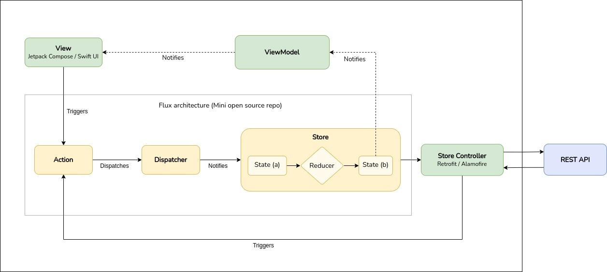

# Saraoke
Basic Android application that shown the lyrics of the song it's being listening on the Android device.

#### 🚧 Work in progress 🚧

Native Android [`MediaSessionManager`](https://developer.android.com/reference/android/media/session/MediaSessionManager) is used to listen to new media session and extracts the media metadata of the song is being listening. [`MediaController`](https://developer.android.com/reference/android/media/session/MediaController) provides a [callback](https://developer.android.com/reference/android/media/session/MediaController.Callback) for receiving updates from the session.

User has to grant notification permission for the app to allow it listening media changes.

## Tech-stack
- [100% Kotlin](https://kotlinlang.org/) + [Coroutines](https://kotlinlang.org/docs/reference/coroutines-overview.html) + [Flow](https://kotlinlang.org/docs/flow.html)
- [Jetpack](https://developer.android.com/jetpack/)
    - [Lifecycle](https://developer.android.com/topic/libraries/architecture/lifecycle)
    - [ViewModel](https://developer.android.com/topic/libraries/architecture/viewmodel)
    - [Jetpack Compose](https://developer.android.com/jetpack/compose)
- [Retrofit](https://square.github.io/retrofit/) and [OkHttp](https://github.com/square/okhttp) for networking layer
- [Kodein](https://github.com/Kodein-Framework/Kodein-DI) for dependency injection

### Utils
- [Detekt](https://github.com/arturbosch/detekt): Code smell analysis for Kotlin projects
- [Timber](https://github.com/JakeWharton/timber): Custom logger on top of Android's normal Log class
- [Jsoup](https://jsoup.org/): Java HTML Parser for fetching URLs and extracting and manipulating data

## Architecture

The architecture used in this project is a minimal expression of the [Flux](https://facebook.github.io/flux/) architecture. Specifically, the implementation of the [Mini](https://github.com/hyperdevs-team/mini-kotlin) open source repo is used. The following image briefly shows the components that make up the application architecture and how they communicate with the Mini components. You can read more about this architecture in its [repository documentation](https://github.com/hyperdevs-team/mini-kotlin).



## Third party dependencies

### Genius

[Genius](https://genius.com/) is the world's biggest collection of song lyrics and musical knowledge. [Genius API](https://docs.genius.com/) provides requests to get full information about songs, artists, albums arts, lyrics... Moreover, it provides a request to [search](https://docs.genius.com/#search-h2) any kind of information of a song.

### Spotify

[Spotify](https://www.spotify.com/) is one of the world's largest music streaming service providers. The application developed for Android launches an action through a `BroadcastReceiver` each time a song is played or each time the playback status of the song is changed. By listening to these actions, the data of the song that is playing can be obtained from the extra of the `Intent`. This is the information used to search the song information through the Genius API.

*It is needed to enable the "Device Broadcast Status" option in Spotify app settings to start sending events about the playback of the songs.*

## Usage

In order to build and test the application, a Genius API token has to be specified in `settings.properties` file:
```
geniusApiToken = "<YOUR_GENIUS_API_TOKEN>"
```
